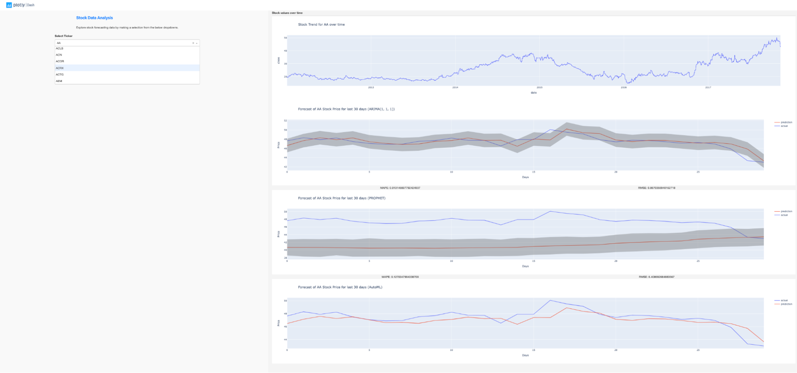

# dash-time-series-forecasting

## About this app

This dashboard allows you to visualize time series forecast for a selected Ticker symbol.

## Requirements

* Python 3

## How to run this app

We suggest you to create a virtual environment for running this app with Python 3. Clone this repository 
and open your terminal/command prompt in the root folder.

```
git clone https://github.com/plotly/dash-sample-apps
cd dash-sample-apps/apps/dash-clinical-analytics
python3 -m virtualenv venv

```
In Unix system:
```
source venv/bin/activate

```
In Windows: 

```
venv\Scripts\activate
```

Install all required packages by running:
```
pip install -r requirements.txt
```

Run this app locally with:
```
python app.py
```

## Screenshot



## Resources

* [Dash](https://dash.plot.ly/)
* Inspired by [dash-clinical-analytics](https://github.com/plotly/dash-sample-apps/tree/main/apps/dash-clinical-analytics).

