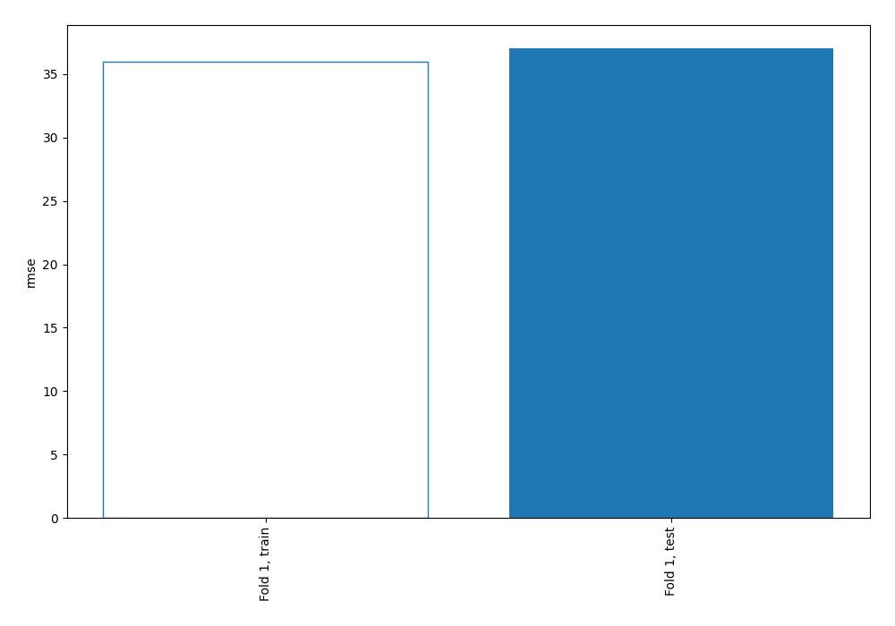
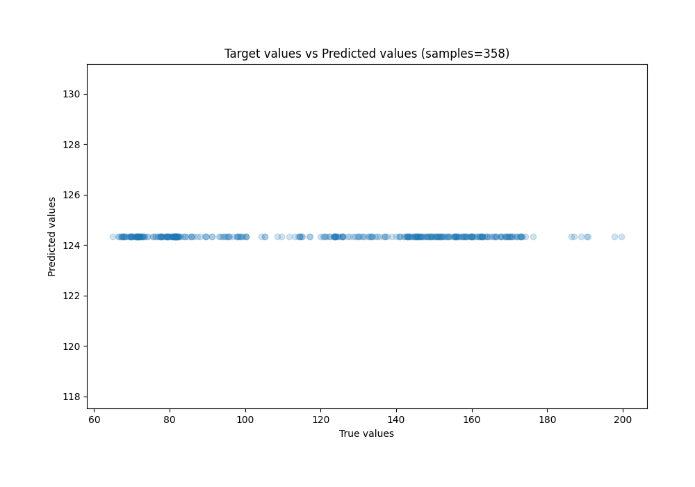
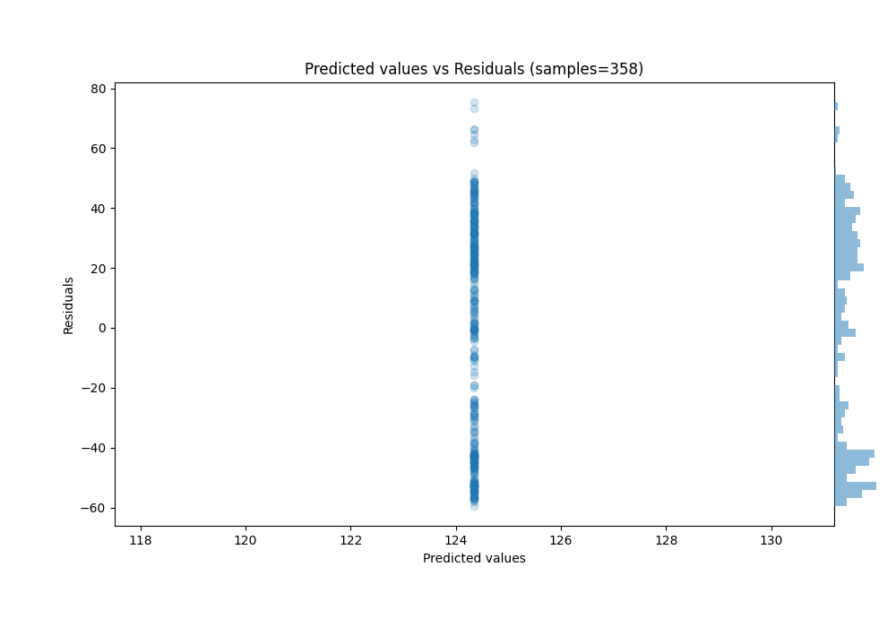

# Summary of 1_Baseline

[<< Go back](../README.md)

## Baseline Regressor (Baseline)
- **n_jobs**: -1
- **explain_level**: 0

## Validation
 - **validation_type**: split
 - **train_ratio**: 0.75
 - **shuffle**: True

## Optimized metric
rmse

## Training time

2.4 seconds

### Metric details:
| Metric   |         Score |
|:---------|--------------:|
| MAE      |   33.1239     |
| MSE      | 1370.55       |
| RMSE     |   37.0209     |
| R2       |   -0.00604671 |
| MAPE     |    0.325793   |

## Learning curves

## True vs Predicted

## Predicted vs Residuals

[<< Go back](../README.md)
