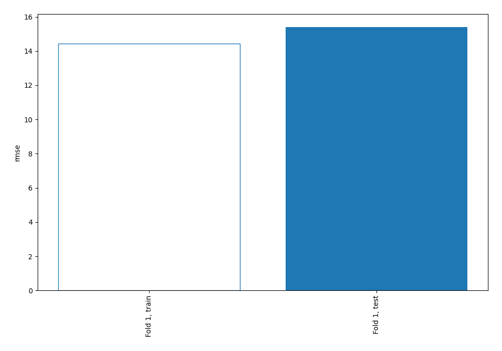
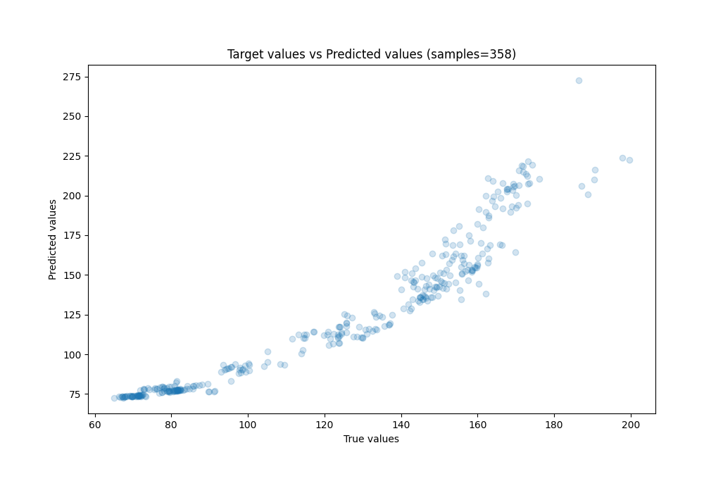
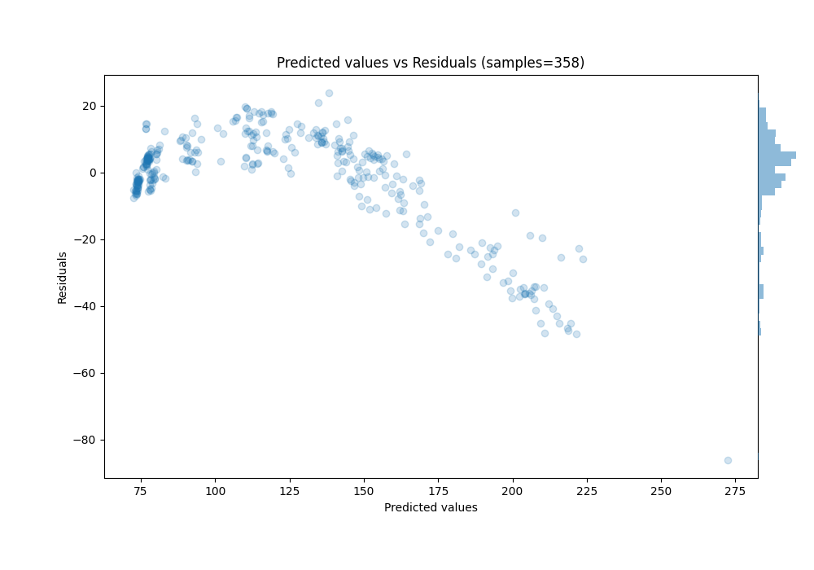

# Summary of 3_Linear

[<< Go back](../README.md)

## Linear Regression (Linear)
- **n_jobs**: -1
- **explain_level**: 0

## Validation
 - **validation_type**: split
 - **train_ratio**: 0.75
 - **shuffle**: True

## Optimized metric
rmse

## Training time

0.9 seconds

### Metric details:
| Metric   |       Score |
|:---------|------------:|
| MAE      |  10.5298    |
| MSE      | 237.142     |
| RMSE     |  15.3994    |
| R2       |   0.825921  |
| MAPE     |   0.0784653 |

## Learning curves

## True vs Predicted

## Predicted vs Residuals

[<< Go back](../README.md)
