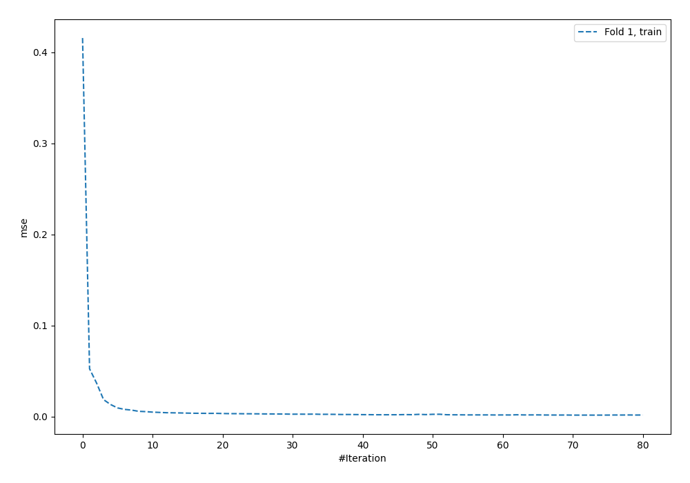
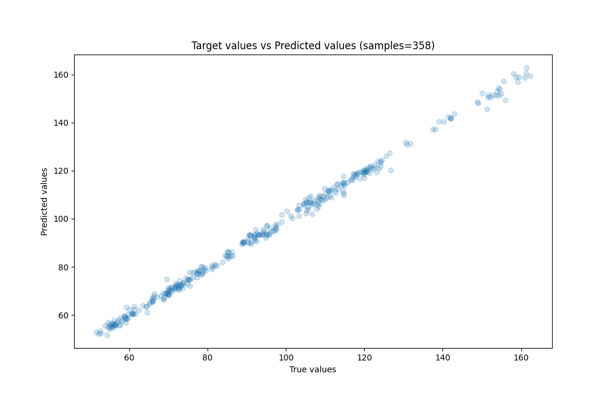
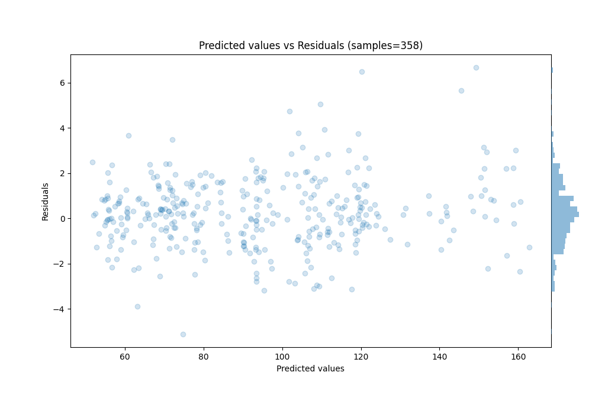

# Summary of 5_Default_NeuralNetwork

[<< Go back](../README.md)

## Neural Network
- **n_jobs**: -1
- **dense_1_size**: 32
- **dense_2_size**: 16
- **learning_rate**: 0.05
- **explain_level**: 0

## Validation
 - **validation_type**: split
 - **train_ratio**: 0.75
 - **shuffle**: True

## Optimized metric
rmse

## Training time

0.4 seconds

### Metric details:
| Metric   |     Score |
|:---------|----------:|
| MAE      | 1.15655   |
| MSE      | 2.42238   |
| RMSE     | 1.5564    |
| R2       | 0.996868  |
| MAPE     | 0.0127785 |

## Learning curves

## True vs Predicted

## Predicted vs Residuals

[<< Go back](../README.md)
