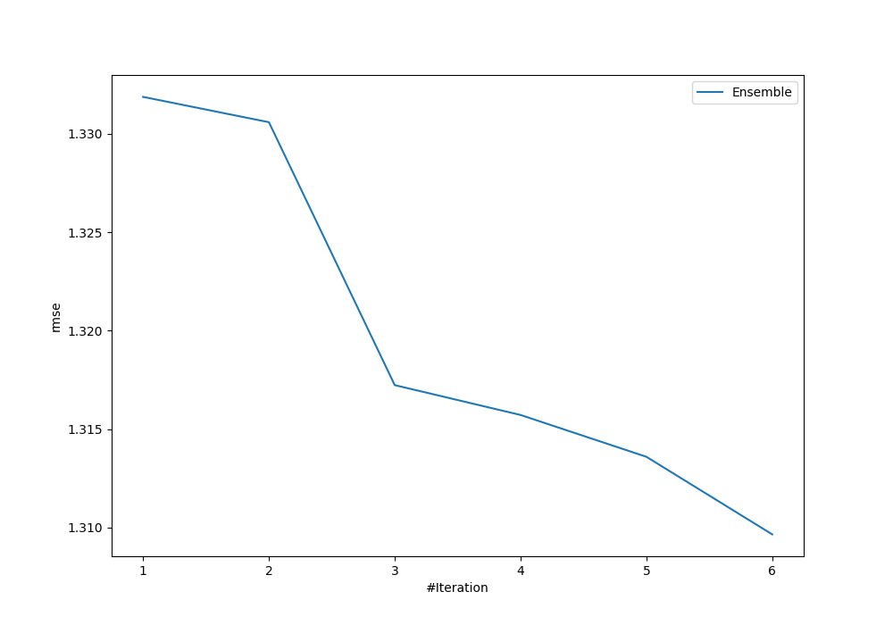
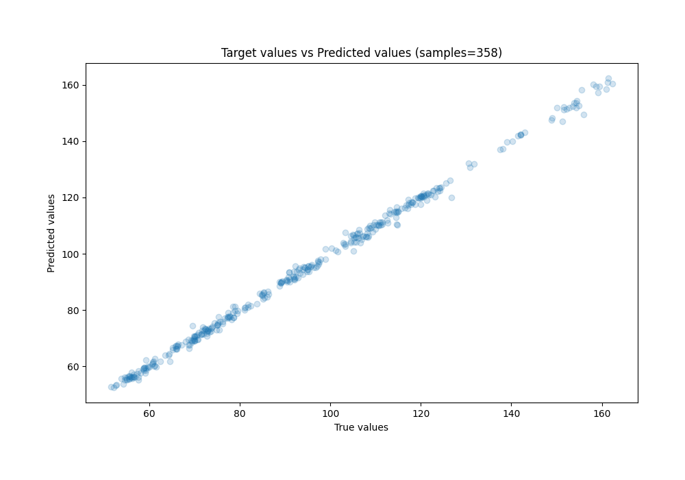
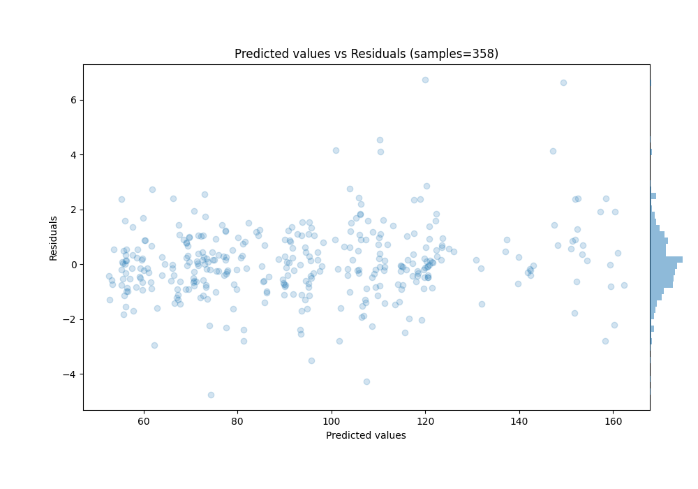

# Summary of Ensemble

[<< Go back](../README.md)

## Ensemble structure
| Model                  |   Weight |
|:-----------------------|---------:|
| 3_Linear               |        4 |
| 4_Default_Xgboost      |        1 |
| 6_Default_RandomForest |        1 |

### Metric details:
| Metric   |     Score |
|:---------|----------:|
| MAE      | 0.926687  |
| MSE      | 1.71521   |
| RMSE     | 1.30966   |
| R2       | 0.997782  |
| MAPE     | 0.0102644 |

## Learning curves

## True vs Predicted

## Predicted vs Residuals

[<< Go back](../README.md)
