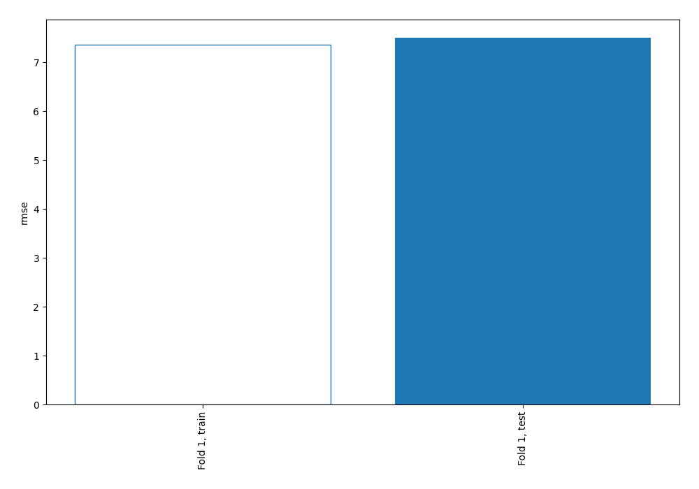
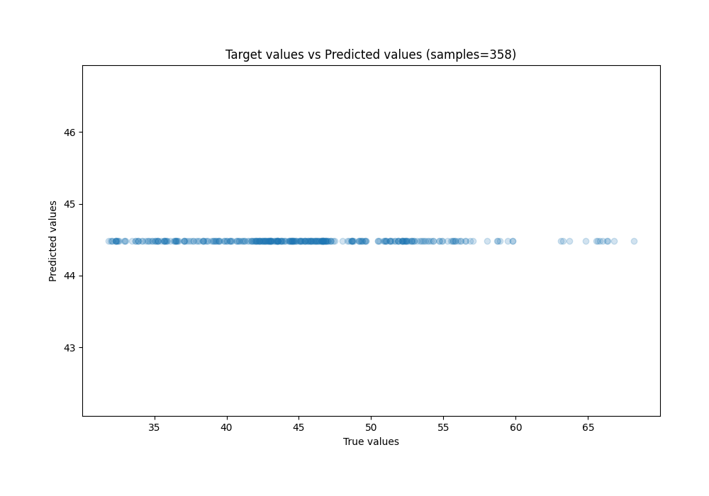
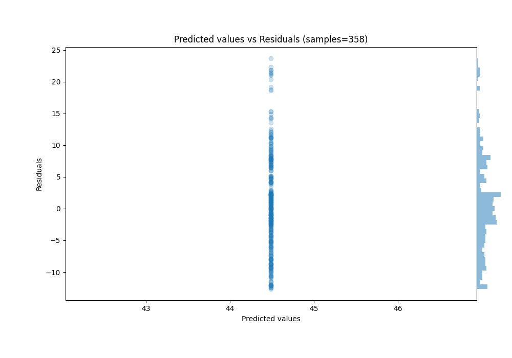

# Summary of 1_Baseline

[<< Go back](../README.md)

## Baseline Regressor (Baseline)
- **n_jobs**: -1
- **explain_level**: 0

## Validation
 - **validation_type**: split
 - **train_ratio**: 0.75
 - **shuffle**: True

## Optimized metric
rmse

## Training time

1.5 seconds

### Metric details:
| Metric   |       Score |
|:---------|------------:|
| MAE      |  5.79711    |
| MSE      | 56.3315     |
| RMSE     |  7.50543    |
| R2       | -0.00790042 |
| MAPE     |  0.129539   |

## Learning curves

## True vs Predicted

## Predicted vs Residuals

[<< Go back](../README.md)
