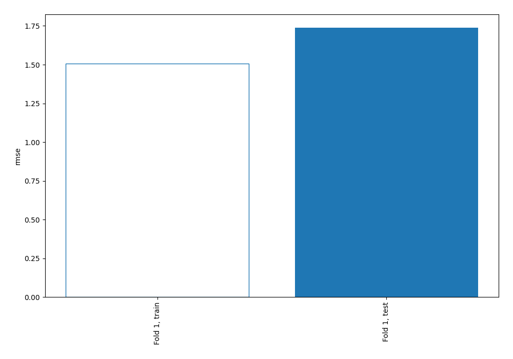
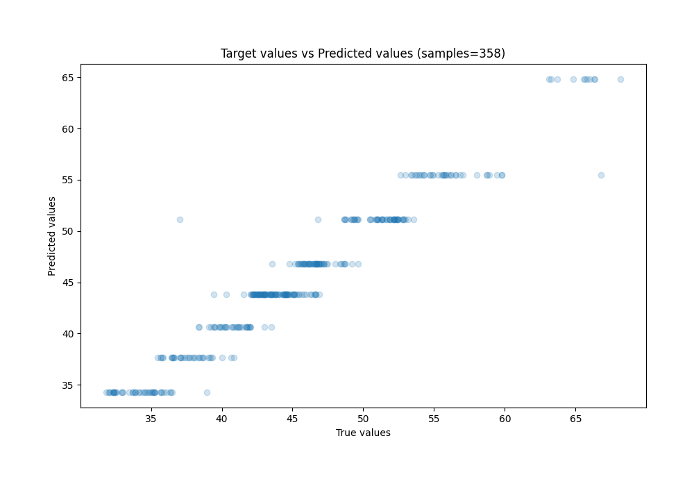
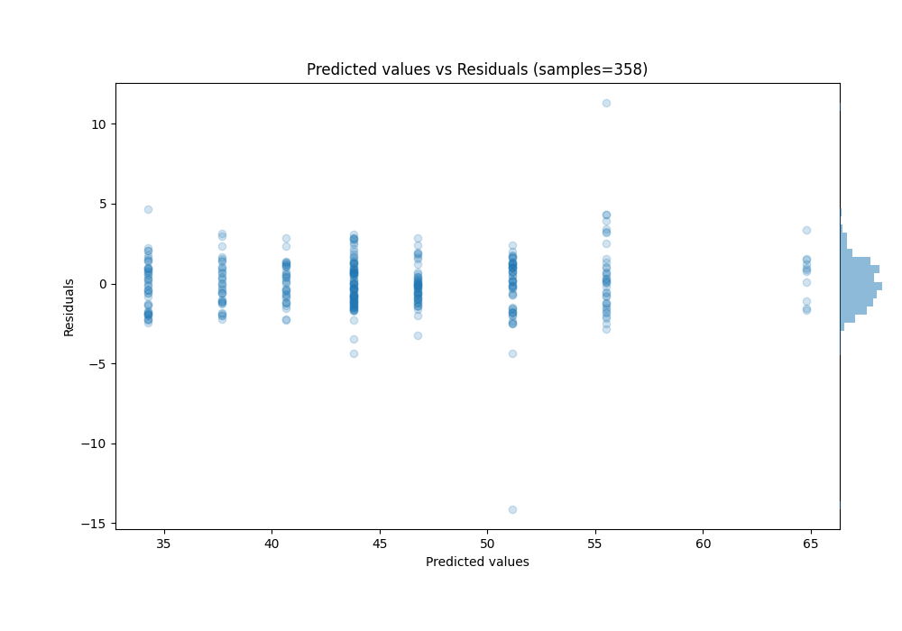

# Summary of 2_DecisionTree

[<< Go back](../README.md)

## Decision Tree
- **n_jobs**: -1
- **criterion**: mse
- **max_depth**: 3
- **explain_level**: 0

## Validation
 - **validation_type**: split
 - **train_ratio**: 0.75
 - **shuffle**: True

## Optimized metric
rmse

## Training time

0.3 seconds

### Metric details:
| Metric   |     Score |
|:---------|----------:|
| MAE      | 1.22981   |
| MSE      | 3.02131   |
| RMSE     | 1.73819   |
| R2       | 0.945942  |
| MAPE     | 0.0277701 |

## Learning curves

## True vs Predicted

## Predicted vs Residuals

[<< Go back](../README.md)
