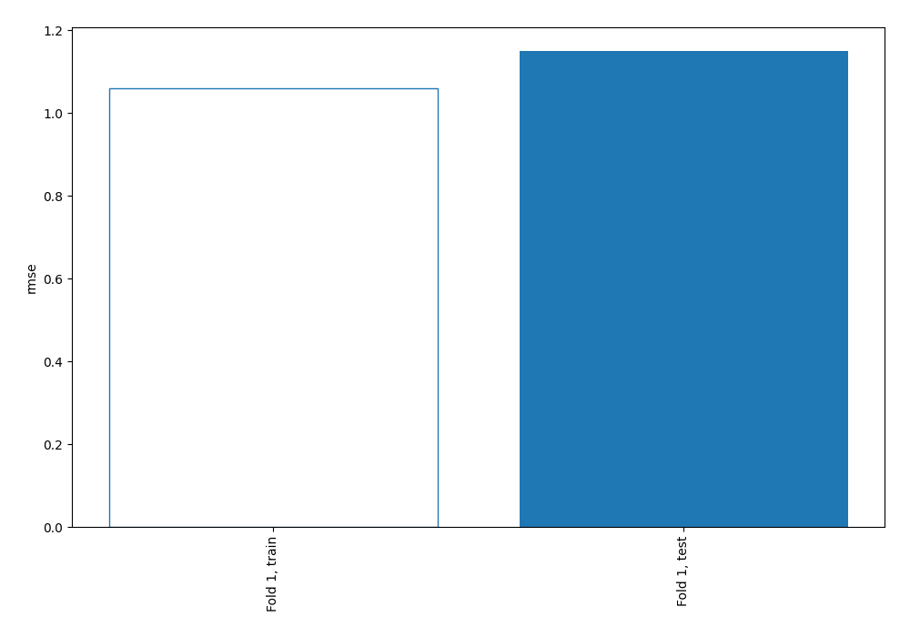
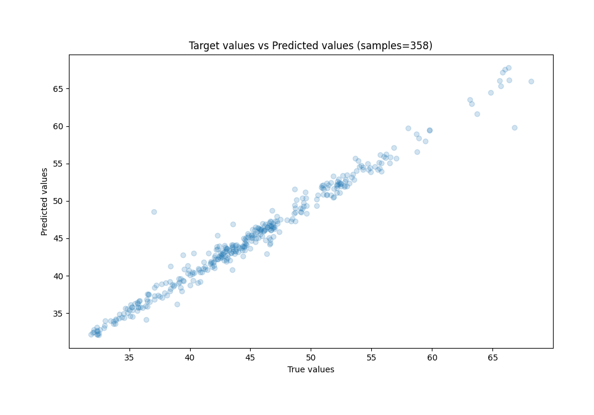
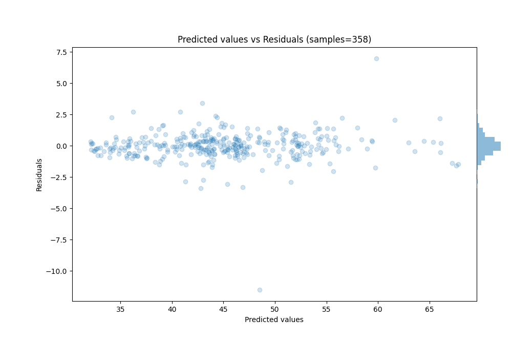

# Summary of 3_Linear

[<< Go back](../README.md)

## Linear Regression (Linear)
- **n_jobs**: -1
- **explain_level**: 0

## Validation
 - **validation_type**: split
 - **train_ratio**: 0.75
 - **shuffle**: True

## Optimized metric
rmse

## Training time

0.4 seconds

### Metric details:
| Metric   |     Score |
|:---------|----------:|
| MAE      | 0.705584  |
| MSE      | 1.32046   |
| RMSE     | 1.14911   |
| R2       | 0.976374  |
| MAPE     | 0.0157429 |

## Learning curves

## True vs Predicted

## Predicted vs Residuals

[<< Go back](../README.md)
