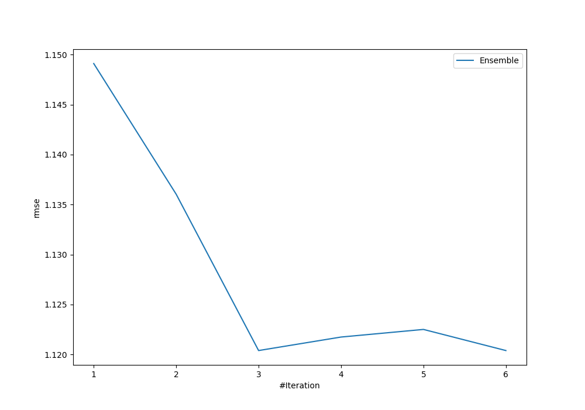
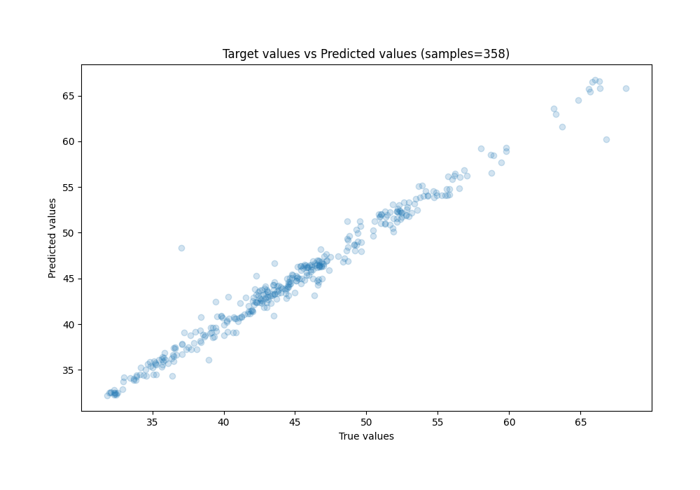
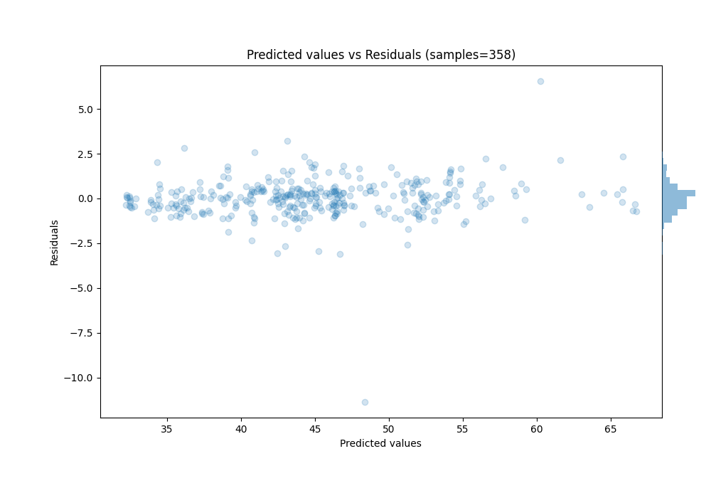

# Summary of Ensemble

[<< Go back](../README.md)

## Ensemble structure
| Model                   |   Weight |
|:------------------------|---------:|
| 3_Linear                |        2 |
| 5_Default_NeuralNetwork |        2 |
| 6_Default_RandomForest  |        2 |

### Metric details:
| Metric   |     Score |
|:---------|----------:|
| MAE      | 0.700232  |
| MSE      | 1.25528   |
| RMSE     | 1.12039   |
| R2       | 0.97754   |
| MAPE     | 0.0156574 |

## Learning curves

## True vs Predicted

## Predicted vs Residuals

[<< Go back](../README.md)
