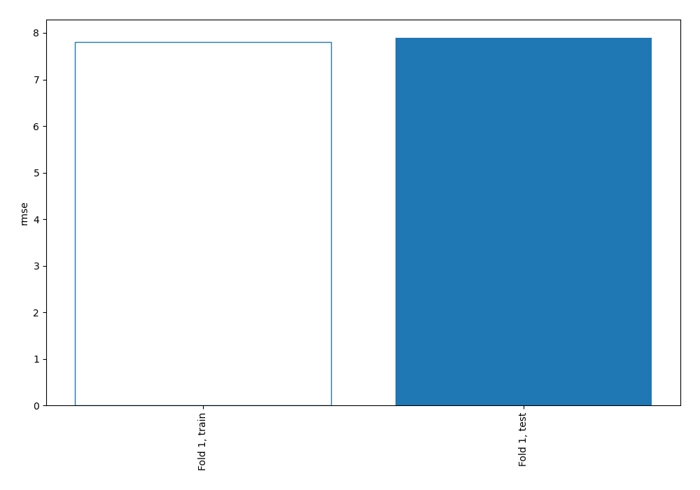
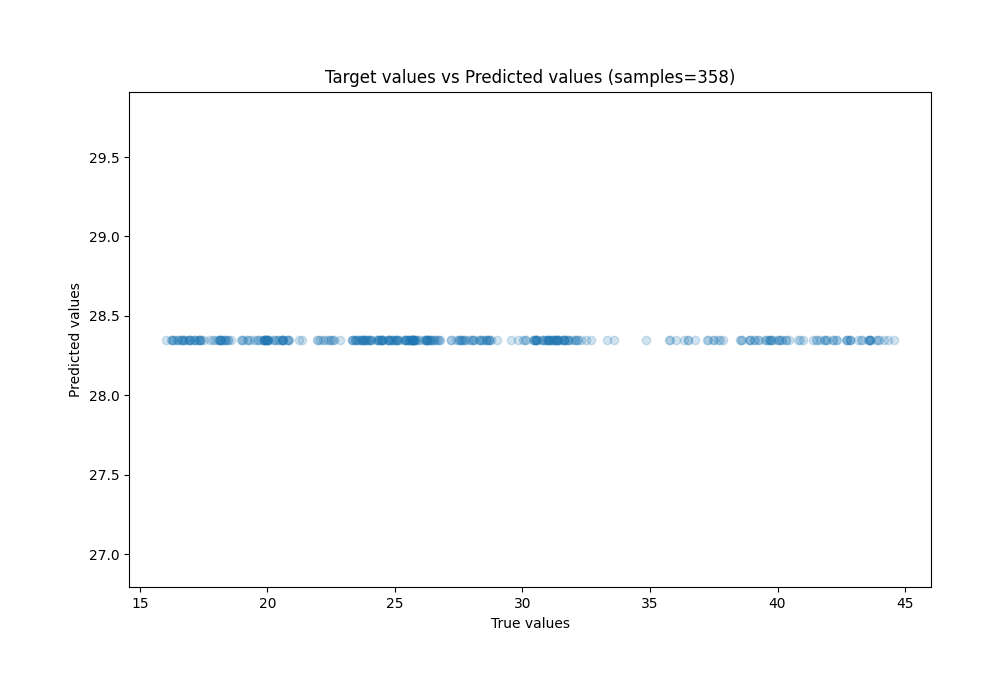
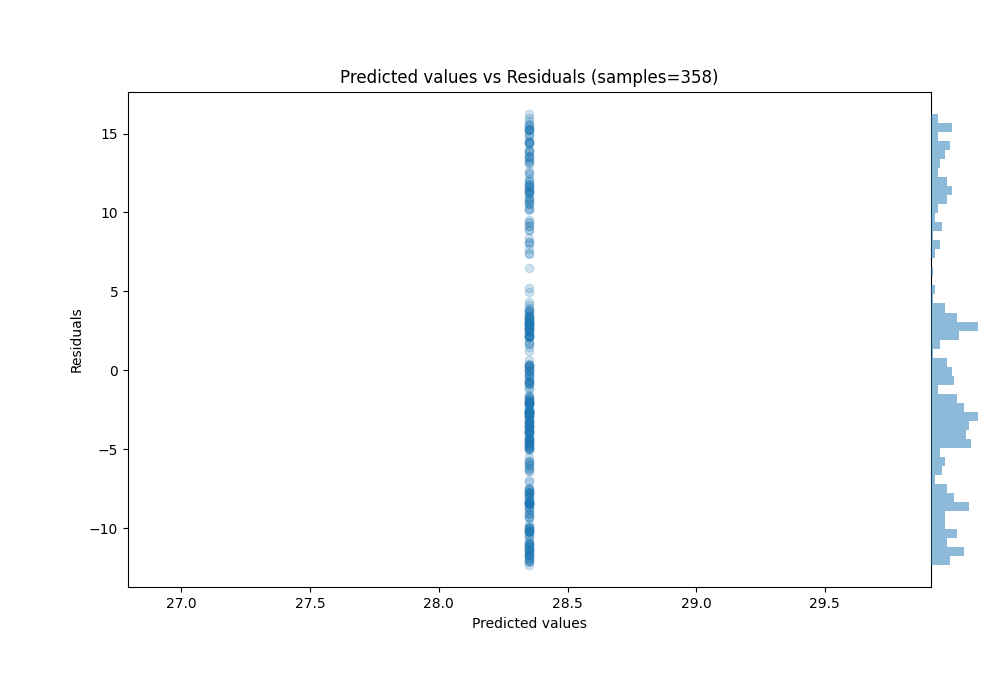

# Summary of 1_Baseline

[<< Go back](../README.md)

## Baseline Regressor (Baseline)
- **n_jobs**: -1
- **explain_level**: 0

## Validation
 - **validation_type**: split
 - **train_ratio**: 0.75
 - **shuffle**: True

## Optimized metric
rmse

## Training time

1.6 seconds

### Metric details:
| Metric   |       Score |
|:---------|------------:|
| MAE      |  6.55376    |
| MSE      | 62.3172     |
| RMSE     |  7.89412    |
| R2       | -0.00247303 |
| MAPE     |  0.25379    |

## Learning curves

## True vs Predicted

## Predicted vs Residuals

[<< Go back](../README.md)
