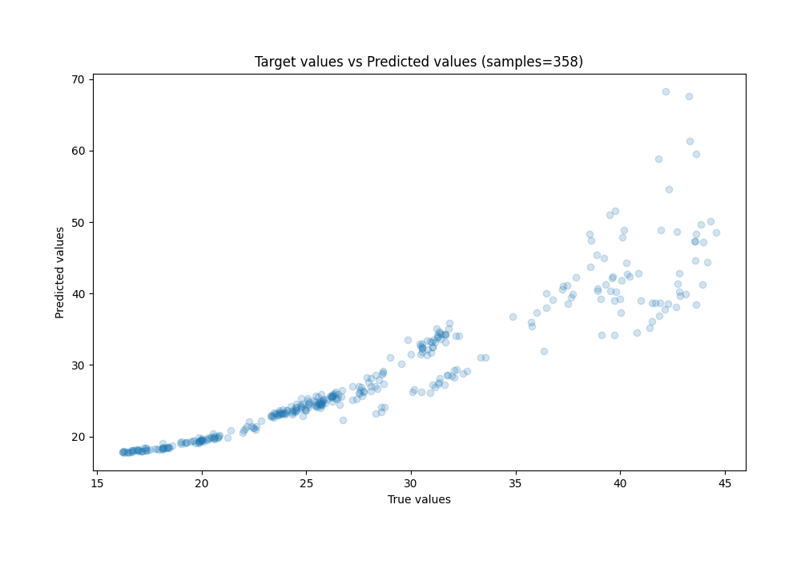
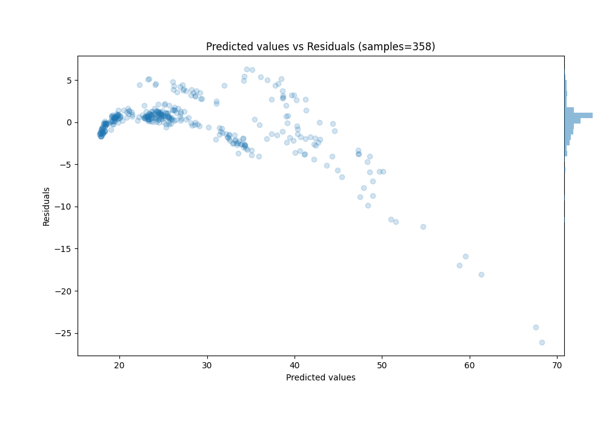

# Summary of 3_Linear

[<< Go back](../README.md)

## Linear Regression (Linear)
- **n_jobs**: -1
- **explain_level**: 0

## Validation
 - **validation_type**: split
 - **train_ratio**: 0.75
 - **shuffle**: True

## Optimized metric
rmse

## Training time

0.3 seconds

### Metric details:
| Metric   |      Score |
|:---------|-----------:|
| MAE      |  2.00941   |
| MSE      | 12.5256    |
| RMSE     |  3.53915   |
| R2       |  0.798456  |
| MAPE     |  0.0626805 |

## Learning curves

## True vs Predicted

## Predicted vs Residuals

[<< Go back](../README.md)
