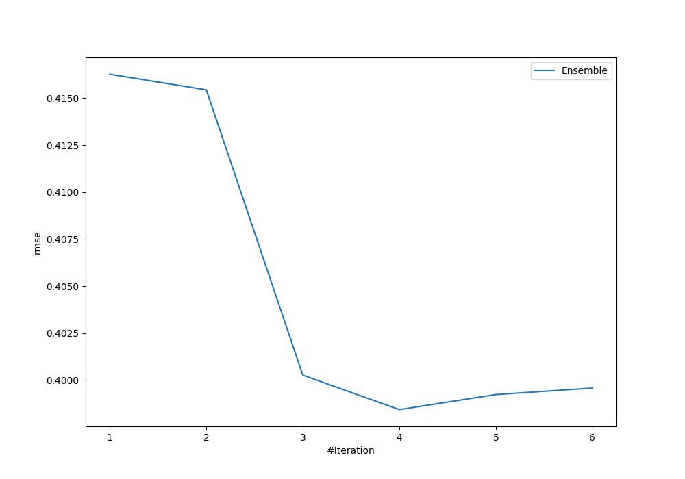
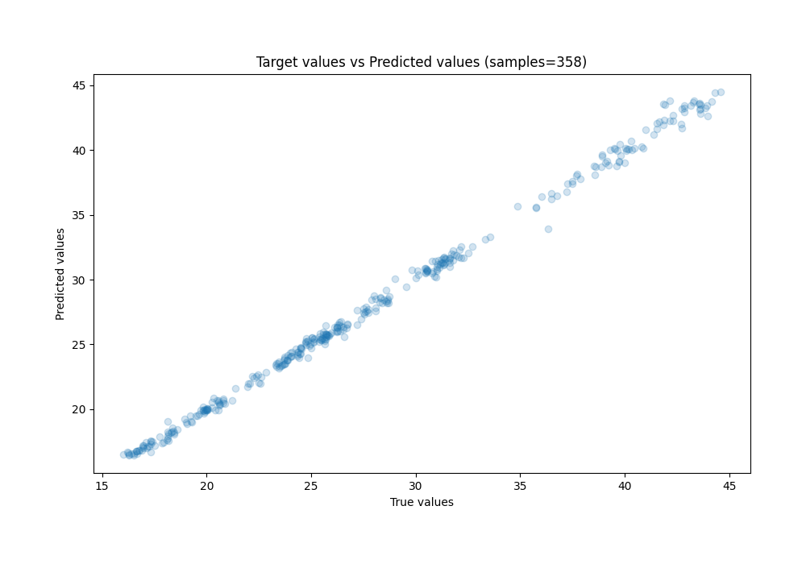
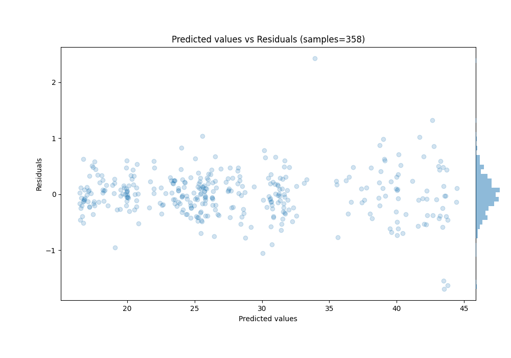

# Summary of Ensemble

[<< Go back](../README.md)

## Ensemble structure
| Model                   |   Weight |
|:------------------------|---------:|
| 4_Default_Xgboost       |        3 |
| 5_Default_NeuralNetwork |        1 |

### Metric details:
| Metric   |     Score |
|:---------|----------:|
| MAE      | 0.2869    |
| MSE      | 0.158748  |
| RMSE     | 0.398432  |
| R2       | 0.997446  |
| MAPE     | 0.0102505 |

## Learning curves

## True vs Predicted

## Predicted vs Residuals

[<< Go back](../README.md)
