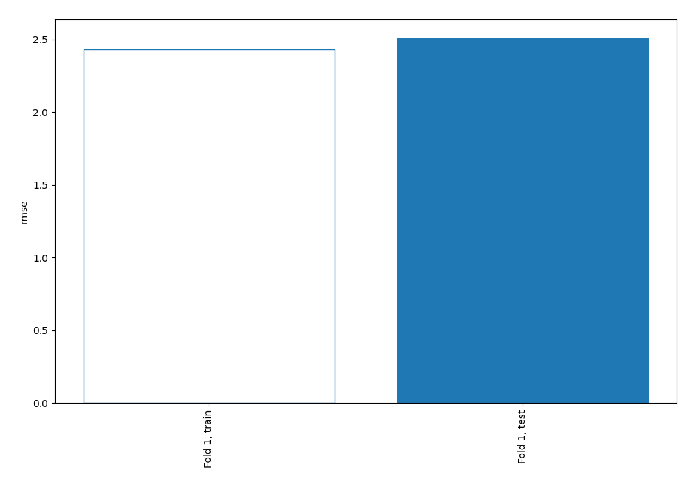
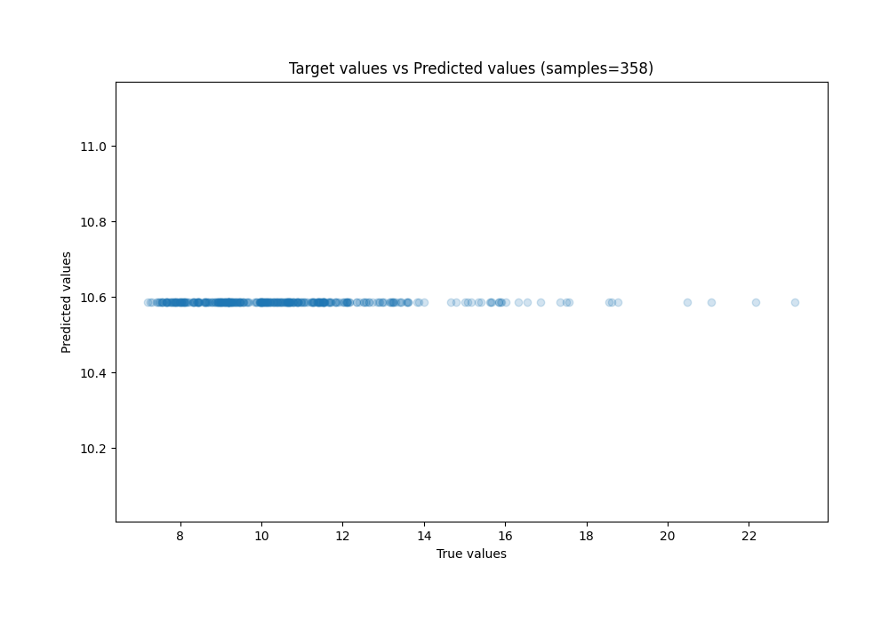
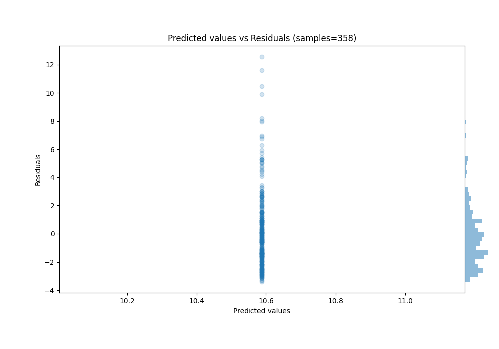

# Summary of 1_Baseline

[<< Go back](../README.md)

## Baseline Regressor (Baseline)
- **n_jobs**: -1
- **explain_level**: 0

## Validation
 - **validation_type**: split
 - **train_ratio**: 0.75
 - **shuffle**: True

## Optimized metric
rmse

## Training time

2.0 seconds

### Metric details:
| Metric   |        Score |
|:---------|-------------:|
| MAE      |  1.82013     |
| MSE      |  6.31955     |
| RMSE     |  2.51387     |
| R2       | -1.80799e-05 |
| MAPE     |  0.169211    |

## Learning curves

## True vs Predicted

## Predicted vs Residuals

[<< Go back](../README.md)
