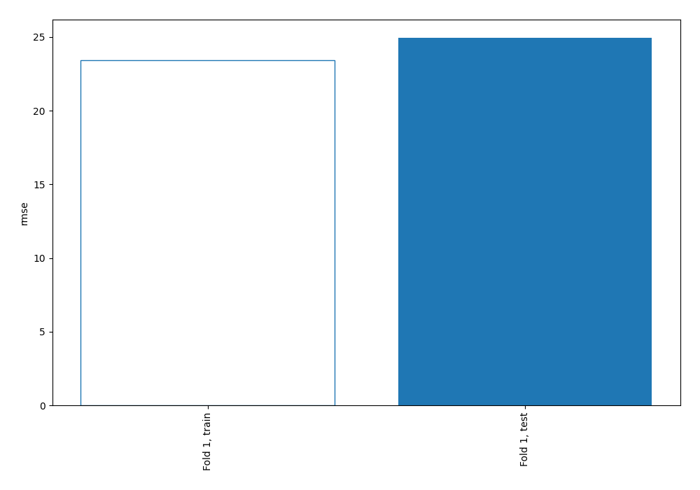
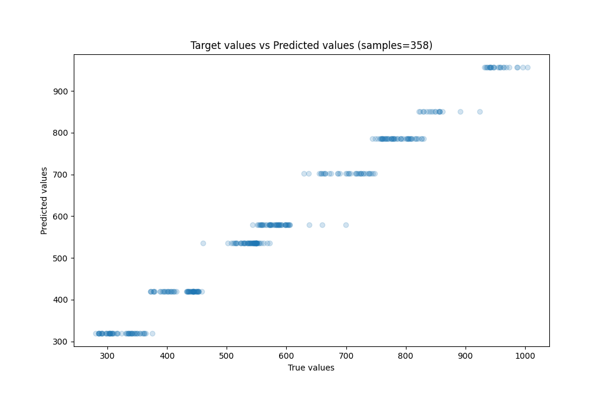
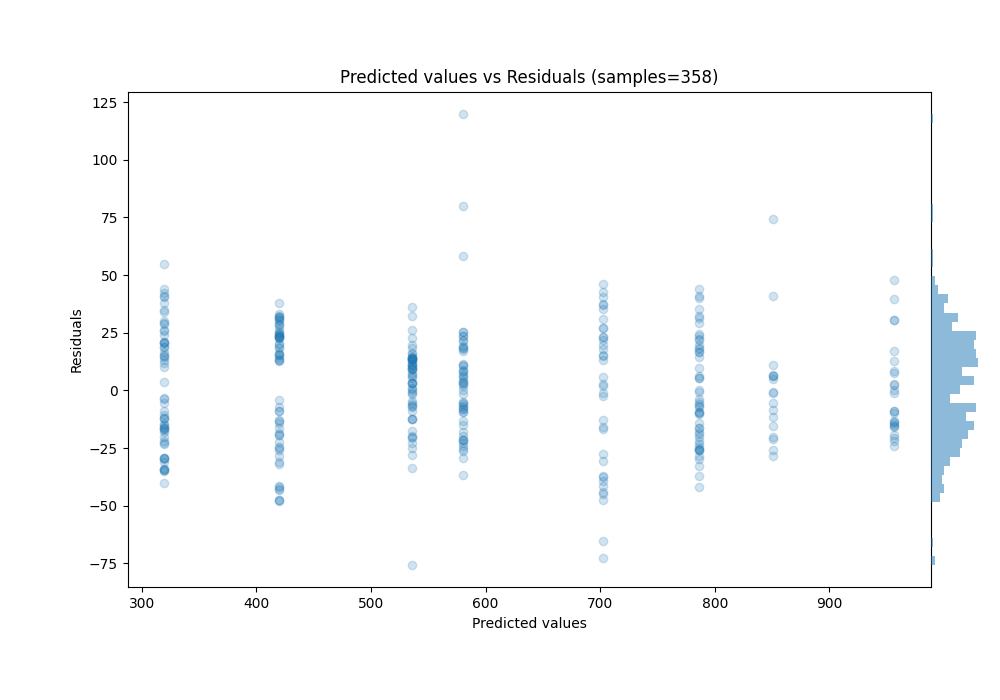

# Summary of 2_DecisionTree

[<< Go back](../README.md)

## Decision Tree
- **n_jobs**: -1
- **criterion**: mse
- **max_depth**: 3
- **explain_level**: 0

## Validation
 - **validation_type**: split
 - **train_ratio**: 0.75
 - **shuffle**: True

## Optimized metric
rmse

## Training time

0.3 seconds

### Metric details:
| Metric   |       Score |
|:---------|------------:|
| MAE      |  20.3649    |
| MSE      | 622.508     |
| RMSE     |  24.9501    |
| R2       |   0.983095  |
| MAPE     |   0.0401211 |

## Learning curves

## True vs Predicted

## Predicted vs Residuals

[<< Go back](../README.md)
