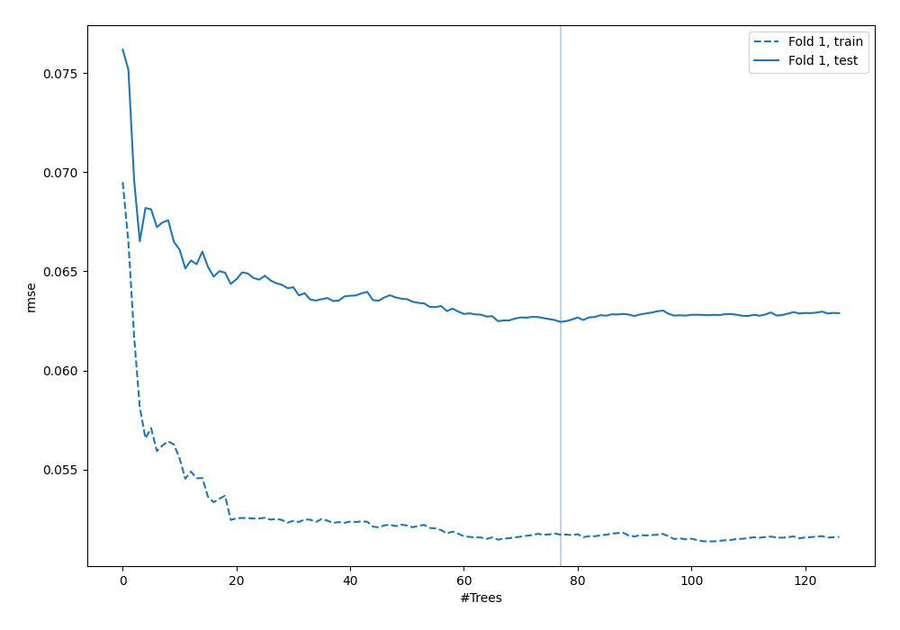
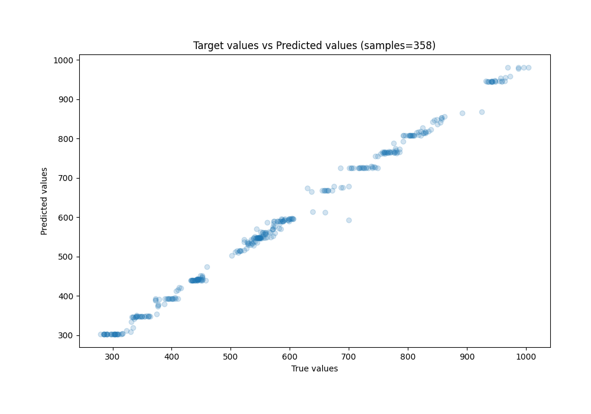
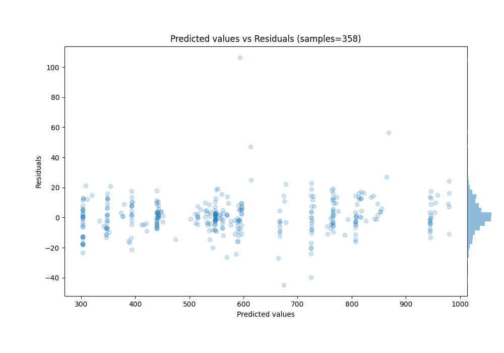

# Summary of 6_Default_RandomForest

[<< Go back](../README.md)

## Random Forest
- **n_jobs**: -1
- **criterion**: mse
- **max_features**: 0.9
- **min_samples_split**: 30
- **max_depth**: 4
- **eval_metric_name**: rmse
- **explain_level**: 0

## Validation
 - **validation_type**: split
 - **train_ratio**: 0.75
 - **shuffle**: True

## Optimized metric
rmse

## Training time

0.8 seconds

### Metric details:
| Metric   |       Score |
|:---------|------------:|
| MAE      |   8.02228   |
| MSE      | 145.614     |
| RMSE     |  12.067     |
| R2       |   0.996046  |
| MAPE     |   0.0150593 |

## Learning curves

## True vs Predicted

## Predicted vs Residuals

[<< Go back](../README.md)
