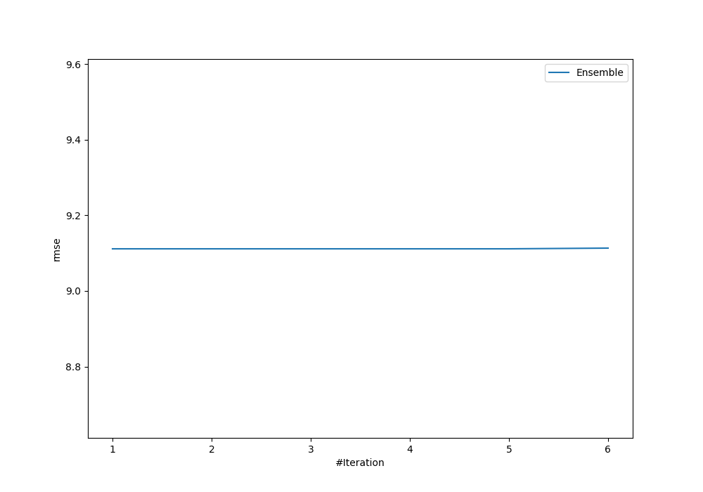
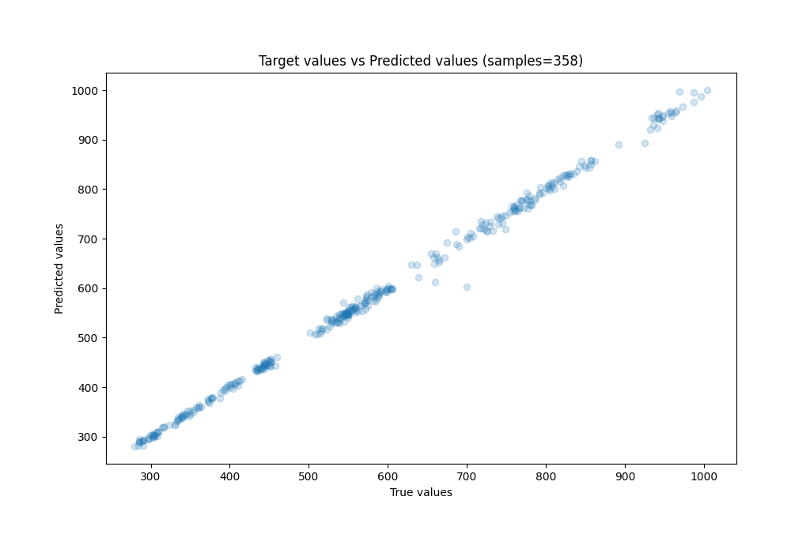
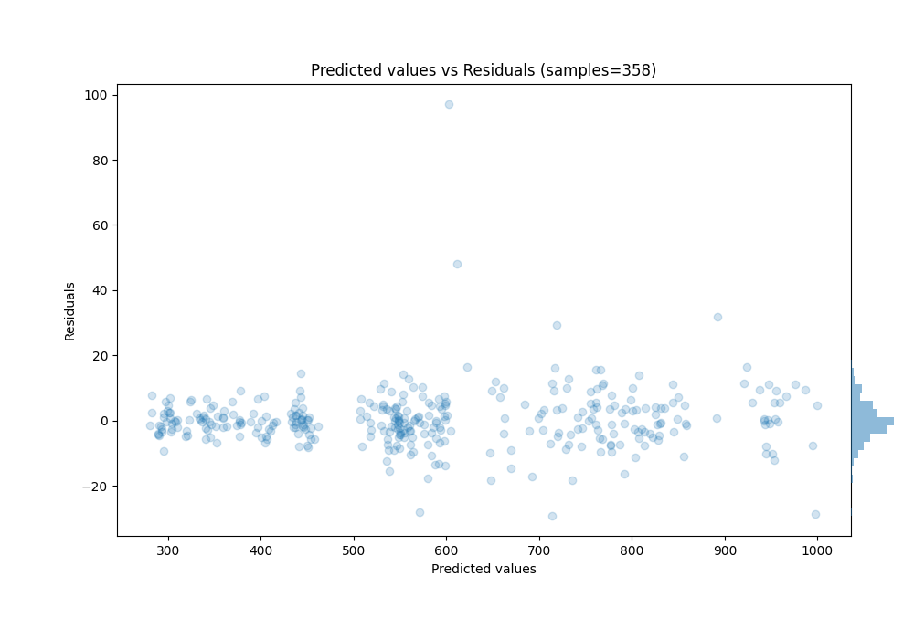

# Summary of Ensemble

[<< Go back](../README.md)

## Ensemble structure
| Model    |   Weight |
|:---------|---------:|
| 3_Linear |        3 |

### Metric details:
| Metric   |       Score |
|:---------|------------:|
| MAE      |  5.47628    |
| MSE      | 83.0367     |
| RMSE     |  9.11245    |
| R2       |  0.997745   |
| MAPE     |  0.00932479 |

## Learning curves

## True vs Predicted

## Predicted vs Residuals

[<< Go back](../README.md)
